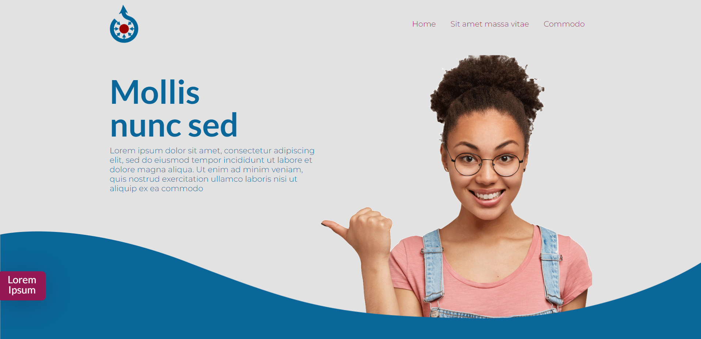
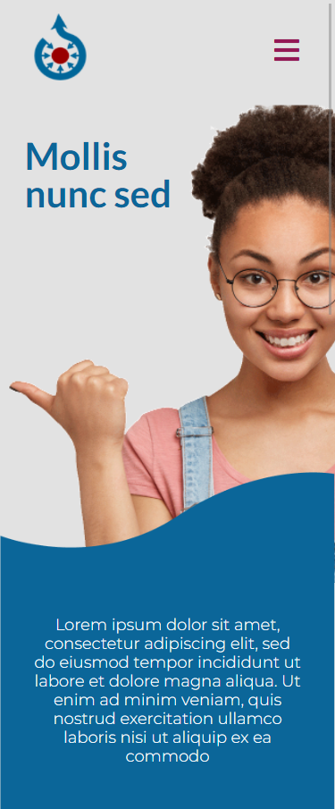

## 🎨 Inpx Theme | Tema criado com HTML, SASS, JS

Olá segue as instruções para baixar o tema, primeiro é clonar ou baixar o repositório 

```
git@github.com:mateuszao/theme-inpx.git
```

logo após é só abrir que já está pronto, para modificar o css recomendo usar alguma ide que tenha compilador de sass eu costumo usar o vscode com a extensão ``Live Sass Compiler`` lembre-se que para usar essa extensão é necessário ter o live server também do vscode ``Live Server``  o tema vai ficar parecido com os prints abaixo:



No mobile vai ficar:

 